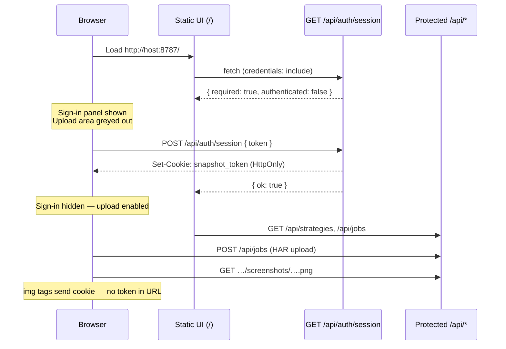

# Snapshot

**Local-first HAR page reconstruction.** Upload (or paste) a network capture, replay it offline with Playwright, and browse screenshots in capture-time order.

Nothing leaves your machine: HARs and PNGs stay under `data/`. Playwright runs locally.

| | |
|--|--|
| **Version** | `0.1.0` — see [CHANGELOG.md](CHANGELOG.md) |
| **UI** | http://localhost:5173 |
| **API** | http://localhost:8787 |
| **Stack** | pnpm monorepo · Vite/React · Hono · Playwright · TypeScript |

---

## Quick start

```bash
pnpm install   # also installs Chromium for Playwright
pnpm dev       # web + API (dev)
```

**Production** (single port UI + API) — see [DEPLOYMENT.md](DEPLOYMENT.md):

```bash
./deploy/container-deploy.sh --host-nginx --domain snapshot.example.com --certbot --email you@example.com
./deploy/vm-deploy.sh --nginx --domain snapshot.example.com --certbot --email you@example.com
```

**Lab / LAN exposure** (`--public` binds `0.0.0.0` and **requires** `SNAPSHOT_API_TOKEN`):

```bash
export SNAPSHOT_API_TOKEN="$(openssl rand -hex 32)"
./deploy/container-deploy.sh --public
# or: ./deploy/vm-deploy.sh --public
```

Then open `http://<server-ip>:8787/`. See [Public deployment & web UI auth](#public-deployment--web-ui-auth) below.

1. Open the UI  
2. Drop a **HAR with content** (or `.har.zip`), or paste check-result JSON / base64  
3. Pick a **capture strategy**  
4. Click **Reconstruct pages**  
5. Scrub the timeline (filter by kind if you used multi-frame strategies)

CLI (same engine):

```bash
pnpm replay -- path/to/capture.har
pnpm replay -- --strategy page-timing path/to/session.har.zip
pnpm replay -- --scroll --out ./har-screenshots path/to/capture.har
pnpm replay -- --no-cors path/to/capture.har   # serve all HAR hits (A/B vs default CORS)
```

---

## Features

- **Offline reconstruction** from HAR / Playwright zip via a shared fulfill router  
- **Browser-faithful CORS** — cross-origin `fetch`/XHR blocked when HAR CORS headers would fail in a real browser (toggleable)  
- **Pluggable strategies** — one API/UI dropdown for navigation, load milestones, or scroll frames  
- **Timeline** — ordered screenshots with kind badges and filters (`all` / `navigation` / `milestone` / `periodic`)  
- **Recent jobs** — reopen completed runs without re-uploading  
- **Multiple inputs** — DevTools HAR, Playwright attach zip, check-result JSON, paste  
- **Parity** — web app and `pnpm replay` share `@snapshot/core` + `@snapshot/replay`  
- **Post-capture cleanup** — after a successful job, uploaded HAR / zip body files are deleted; only `job.json` + screenshots remain

---

## Capturing a good HAR

1. Chrome/Edge DevTools → **Network**  
2. Enable **Preserve log** for multi-page flows  
3. Load the pages you care about (wait until settled)  
4. Right-click → **Save all as HAR with content**

Headers-only exports will look empty. Snapshot reports **body coverage %** after indexing.

### Playwright attach zip

```
export.har.zip
├── har.har              # HAR JSON; bodies via content._file
└── <hash> / asset.js …  # raw response bodies
```

Snapshot extracts the **full** archive (HAR + sidecars) into the job folder so `_file` bodies resolve during replay.

---

## Input formats

| Input | How |
|-------|-----|
| DevTools `.har` | Drop / choose file |
| Playwright `.har.zip` | Drop / choose — full extract including `_file` assets |
| Check-result JSON (`harZipBase64` / `har`) | File or **paste** in UI |
| Raw `harZipBase64` / data URL | Paste in UI |
| Max size | 200MB |

---

## How it works

```text
Upload / paste
    → ingest (@snapshot/replay)     normalize to capture.har (+ zip assets)
    → index (@snapshot/core)        main-frame navigations, timings, HarSourceInfo
    → plan (CaptureStrategy)        ordered CapturePoint[]
    → capture (executeCapturePlan)  Playwright + HAR fulfill router → PNGs
    → cleanup (API worker)          delete HAR / zip sidecars on success
    → timeline                      items by atMs + kind (job.json + PNGs only)
```

Multi-stage points for the **same URL** share one browser session (progressive load / scroll).

### HAR replay CORS (screenshots)

By default (`enforceCors: true`), during offline replay Snapshot **blocks** cross-origin requests that a real browser would refuse:

- HAR entries with `status: 0` or CORS-related `_failureText`
- Cross-origin `fetch` / XHR / `eventsource` (and `crossorigin` assets) without a matching `Access-Control-Allow-Origin`

So screenshots match what the user could see — not “phantom” API data that CORS would hide. Job **Notes** list every blocked URL (scrollable in the UI).

| Mode | UI | CLI | Behavior |
|------|----|-----|----------|
| **On (default)** | **Enforce CORS** checked | (default) | Browser-faithful; may leave SPA shells empty |
| **Off** | Uncheck **Enforce CORS** | `--no-cors` | Serve all matching HAR responses (legacy / compare) |

This is **not** the same as `SNAPSHOT_CORS_ORIGINS` (that only controls whether browsers can call Snapshot’s REST API from another origin). See [DEPLOYMENT.md](DEPLOYMENT.md).

Inspect a URL in a HAR (example):

```bash
jq '
  .log.entries[]
  | select(
      (.request.method | ascii_upcase) == "POST"
      and (.request.url | startswith("https://www.bestbuy.com/gateway/graphql"))
    )
  | {status: .response.status, failure: ._failureText,
     cors: [.response.headers[]? | select(.name | test("access-control"; "i"))]}
' path/to/capture.har
```

The CLI (`pnpm replay`) writes screenshots to an output dir and does **not** delete the source HAR — cleanup applies only to API jobs under `data/jobs/`.

---

## Capture strategies

| ID | Frames per page | Use when |
|----|-----------------|----------|
| `document-navigation` | 1 × full page | Default; multi-page HARs |
| `page-timing` | commit → DCL → load → networkidle → fullpage | Progressive paint |
| `scroll-viewport` | load + scroll viewports + fullpage | Long pages |

```bash
pnpm replay -- --strategy page-timing ./site.har
pnpm replay -- --scroll ./site.har    # → scroll-viewport
```

Timeline **kinds**:

| Kind | Meaning |
|------|---------|
| `navigation` | Primary page shot |
| `milestone` | Load-stage / fullpage |
| `periodic` | Scroll viewport frames |

### Adding a strategy

1. Add a class under `packages/core/src/strategies/` implementing `CaptureStrategy`  
2. Register it in `registerBuiltInStrategies()` (`packages/core/src/registry.ts`)  
3. Rebuild / restart — it appears in the UI and `pnpm replay -- --help`  

Set `stage` / `scrollIndex` on `CapturePoint` when frames should share one Playwright session.

---

## Monorepo layout

```
apps/web              Vite + React (upload, paste, timeline, recent jobs)
apps/server           Hono API + job worker
packages/core         Types, HarIndex, CaptureStrategy registry
packages/replay       Ingest, inspect, HAR router, Playwright capture
scripts/replay-har.ts CLI entry
data/jobs/            Job metadata + screenshots (gitignored; HAR deleted after success)
IMPLEMENT.md          Phased implementation checklist
CHANGELOG.md          Release history
```

---

## Data storage (API server)

The local API (`apps/server`) persists job data **on the machine running the server** only (no remote upload). Root: `data/jobs/` (override with `SNAPSHOT_DATA_DIR`).

### Lifecycle

1. **Ingest** — write `capture.har` (and Playwright zip `_file` sidecars) into `data/jobs/<jobId>/`
2. **Capture** — Playwright reads those files; screenshots land in `screenshots/`
3. **Success** — delete uploaded HAR artifacts; keep `job.json` + `screenshots/`
4. **Failure** — keep the HAR so you can inspect / debug

**During capture:**

```text
data/jobs/<jobId>/
├── capture.har              # uploaded HAR
├── <hash> / …               # zip _file body sidecars (if any)
├── job.json
└── screenshots/
    └── <captureId>.png
```

**After success** (what the timeline UI loads):

```text
data/jobs/<jobId>/
├── job.json                 # metadata, plan, results, warnings, harStats
└── screenshots/
    └── <captureId>.png
```

| Data | During capture | After success | After failure |
|------|----------------|---------------|---------------|
| HAR + zip `_file` bodies | Stored | **Deleted** | Kept (debug) |
| `job.json` | Stored | Kept | Kept |
| Screenshots | Written | Kept | Partial / none |

Ingest may use short-lived OS temp dirs (`/tmp/snapshot-*`); those are removed after the job folder is written.

**Retention:** no TTL or delete-job API yet. Completed jobs leave `job.json` + PNGs under `data/jobs/` until you remove them. The `data/` tree is gitignored.

---

## API

| Method | Path | Description |
|--------|------|-------------|
| GET | `/api/health` | Liveness |
| GET | `/api/auth/session` | Auth required? / session valid? |
| POST | `/api/auth/session` | Exchange token for HttpOnly session cookie |
| DELETE | `/api/auth/session` | Clear session cookie |
| GET | `/api/strategies` | Strategy list |
| GET | `/api/jobs?limit=20` | Recent jobs |
| POST | `/api/jobs` | Create job (multipart **or** JSON/text) |
| GET | `/api/jobs/:id` | Status / progress / `harSource` / warnings |
| GET | `/api/jobs/:id/timeline` | Ordered frames |
| GET | `/api/jobs/:id/screenshots/:captureId.png` | PNG |

### Create job — multipart

`file` + optional `strategyId` (default `document-navigation`) + optional `enforceCors` (`true`/`false`, default `true`).

### Create job — JSON

`content` may be a **string or object** (object form is what you get from `curl` + `jq`). Optional `enforceCors` (boolean, default `true`):

```bash
curl -s -X POST http://localhost:8787/api/jobs \
  -H 'Content-Type: application/json' \
  -d "{\"strategyId\":\"document-navigation\",\"enforceCors\":true,\"content\":$(jq -c . packages/core/fixtures/sample.har.json)}"
```

Also supported: `{ "harZipBase64": "…" }`, `{ "har": "…" }`, or a raw HAR (`log`) merged with `strategyId`:

```bash
jq -c '{strategyId:"document-navigation",enforceCors:true} + .' packages/core/fixtures/sample.har.json \
  | curl -s -X POST http://localhost:8787/api/jobs -H 'Content-Type: application/json' -d @-
```

Job summaries include `enforceCors`. Timeline **Notes** list blocked CORS / HAR-miss URLs when enforcement is on.

When `SNAPSHOT_API_TOKEN` is set, pass `Authorization: Bearer <token>` (or sign in via the web UI — see below).

---

## Public deployment & web UI auth

`--public` exposes Snapshot on the network (`0.0.0.0`) and the deploy scripts **require** `SNAPSHOT_API_TOKEN`. The UI does not change because of `--public` itself — it changes because a token is configured, which enables API authentication.

| Deploy | Typical URL | Sign-in required? |
|--------|-------------|-------------------|
| Default (localhost) | `http://127.0.0.1:8787/` | No (unless you set a token manually) |
| `--public` + token | `http://<server-ip>:8787/` | Yes — first visit |
| nginx + token | `https://snapshot.example.com/` | Yes — first visit |

There is **no** build-time frontend token (`VITE_*`). Tokens are never embedded in the static UI bundle or screenshot URLs.

### First visit (browser)



1. **Load app** — React UI served from the same host/port as the API.
2. **Auth check** — `GET /api/auth/session` returns `{ required: true, authenticated: false }`.
3. **Sign in** — user enters `SNAPSHOT_API_TOKEN`; `POST /api/auth/session` sets an **HttpOnly** `snapshot_token` cookie (7-day lifetime).
4. **Use Snapshot** — upload HAR, pick strategy, view timeline; all `fetch()` calls use `credentials: 'include'`.
5. **Screenshots** — `` sends the cookie automatically (no `?access_token=`).

### Return visit

If the HttpOnly cookie is still valid, `GET /api/auth/session` returns `authenticated: true` and the user goes straight to the upload UI.

### Scripts / curl

```bash
curl -H "Authorization: Bearer $SNAPSHOT_API_TOKEN" \
  http://host:8787/api/strategies
```

Full ops detail: [DEPLOYMENT.md — API authentication](DEPLOYMENT.md#api-authentication).

---

## Scripts

```bash
pnpm dev              # UI + API
pnpm replay -- <file> # CLI screenshots
pnpm test             # core + replay (unit + integration)
pnpm build            # all packages
```

Requires **Node ≥ 20**.

---

## Limitations

HAR replay is **offline network mocking**, not a full browser time machine:

| Situation | Typical result |
|-----------|----------------|
| HAR without response bodies | Blank / broken pages |
| Assets never recorded in the HAR | Missing CSS/JS; incomplete layout |
| Dynamic query tokens | Pathname fallback helps; not perfect |
| Cross-origin `fetch`/XHR without CORS headers in HAR | Blocked during replay (browser-faithful); UI may stay empty |
| SPA needing clicks after load | Only the initial document |
| Captcha / login | Often incomplete offline |
| Iframes / ads | Not separate timeline entries (main frame only) |

Job **Notes** list HAR misses and (when CORS is enforced) every blocked cross-origin request. A few analytics misses are normal; many misses on first-party JS/CSS usually mean an incomplete export.

---

## Documentation

| Doc | Purpose |
|-----|---------|
| [CHANGELOG.md](CHANGELOG.md) | What shipped in each version |
| [IMPLEMENT.md](IMPLEMENT.md) | Phase-by-phase build checklist |
| [DEPLOYMENT.md](DEPLOYMENT.md) | VM + Docker deploy scripts and ops guide |

---

## License

Private / local tooling unless otherwise specified.
